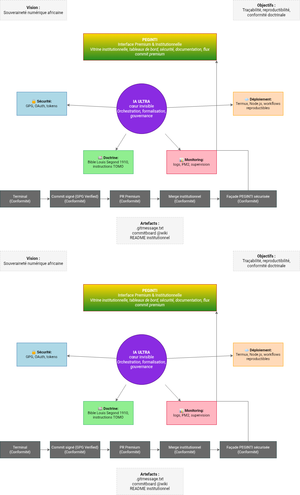

# 🧠 PEGINTICHAT — IA ULTRA
### Noyau technique officiel de l’écosystème PEGINTI
## Dashboard PEGINTI


PEGINTICHAT est un agent conversationnel et un serveur MCP minimal en Node.js, conçu pour faciliter la gestion de la clientèle, l’automatisation et l’assistance technique.  
Le projet est pensé pour être portable, léger, et fonctionnel même sur des environnements contraints comme Android (Termux) ou Linux.

---

# 🌐 Sites officiels

### 🔗 Site principal PEGINTICHAT
https://pegintichat.online/

### 🔗 Site communautaire PEGINTI
https://peginti.e-monsite.com

### 🔗 Dépôt GitHub officiel
https://github.com/pegintiiaultra/PEGINTICHAT.git

---

# 🌍 Écosystème PEGINTI — Architecture à double noyau

PEGINTICHAT repose sur une architecture conceptuelle unique :

## 🔵 1. IA ULTRA — Noyau technique
- API HTTP légère
- Serveur MCP (stdio)
- Détection automatique FR/EN
- Automatisation de tâches
- Compatibilité Android/Termux
- Déploiement PM2/Nginx
- Zéro dépendance native  
👉 Le moteur.

## 🟡 2. PEGINTI — Noyau vision
- Mission éducative africaine
- Gouvernance et identité
- Vision d’autonomisation numérique
- Cadre doctrinal et pédagogique
- Communauté et accompagnement  
👉 La direction.

Cette séparation rend le projet lisible pour les développeurs et fidèle à la vision PEGINTI.

---

# 🎯 Objectifs du projet

- Fournir un agent conversationnel polyvalent
- Proposer un serveur MCP stdio simple et extensible
- Faciliter la gestion clientèle, l’automatisation et l’assistance technique
- Offrir une base technique claire pour des projets professionnels ou communautaires
- Être compatible Android / Linux / Windows
- Rester open‑source et maintenable

---

# ⚙️ Prérequis

- Node.js ≥ 18
- npm

---

# 📊 Dashboard PEGINTI

Le tableau institutionnel matérialise la façade premium et le Noyau IA Ultra.  
Il est disponible en deux formats :
- **dashboard-peginti.drawio** (éditable, traçable)
- **dashboard-peginti.png** (visuel premium)

## Visuel


### Flux institutionnel
Terminal → Commit signé (GPG Verified) → PR Premium → Merge institutionnel → Façade PEGINTI sécurisée

---

# 🌟 Vision entrepreneuriale — TomTech.inc

TomTech.inc est la structure fondatrice et porteuse de la vision PEGINTI.  
Sa mission est de :
- Institutionnaliser des standards africains en intelligence artificielle et en programmation.  
- Offrir des solutions numériques souveraines et reproductibles.  
- Harmoniser identité culturelle et innovation technologique.  
- Déployer PEGINTICHAT et Noyau IA Ultra comme piliers de gouvernance numérique.  

---

# 📞 Coordonnées

**Fondateur :** TOMO OMBEDE BARNABÉ BERTRAND  
**Entreprise :** TomTech.inc  
**Localisation :** Yaoundé II SOA, Cameroun  
**Email :** bertrandtomo7@gmail.com  
**WhatsApp :** +237 691482453
# 📦 Installation

```bash
git clone https://github.com/pegintiiaultra/PEGINTICHAT.git
cd PEGINTICHAT
npm install
npm start
